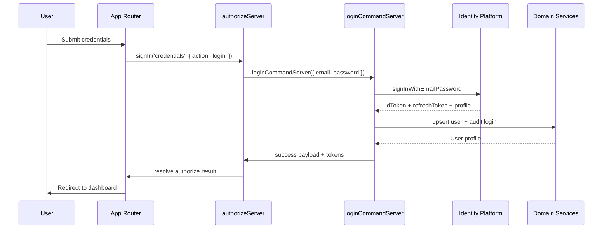

# Authentication Flow

This document explains how the Request & Approval System handles authentication with **NextAuth Credentials** and **Google Identity Platform**.

---

## Context

- **Identity Provider**: Google Cloud Identity Platform (email & password)
- **Session broker**: NextAuth Credentials provider
- **User store**: Drizzle ORM + PostgreSQL
- **Roles**: `ADMIN`, `MEMBER`, `GUEST` (permissions resolved via `AccountManagementService#getPermissionsForRoles`)

---

## High-Level Flow

```
Client (App Router)
        │
        │ signIn('credentials', { action })
        ▼
authorizeServer (features/auth/servers/authorization.server.ts)
        │
        │ loginCommandServer / signUpCommandServer
        ▼
AuthenticationService → Identity Platform
        │
        │ idToken + refreshToken + profile
        ▼
AccountManagementService + AuditService
        │
        │ Persist / hydrate / audit
        ▼
HttpOnly cookies + NextAuth session
```

### Token & Cookie Strategy

| Item | Details | Storage |
|------|---------|---------|
| **ID Token** | 1-hour JWT validated on the server | `id-token` (httpOnly, SameSite=Lax, Secure in prod) |
| **Refresh Token** | Used with `https://securetoken.googleapis.com/v1/token` to obtain a new ID token | `refresh-token` (httpOnly, 30 days) |

Token utilities live in `features/auth/servers/token.server.ts`. `refreshIdTokenServer` checks expiry, calls `refreshIdTokenCommandServer`, and updates both cookies when necessary.

---

## Sequence Diagram



Sign-up follows the same path with `action: 'signup'`. Sign-out executes `useSignOut` → `deleteAuthCookiesAction` → `signOut({ redirect: false })` → `/login`.

---

## Key Components

### Authorization Server

`authorizeServer` inspects the `action` field and delegates to the appropriate command handler. On success it sets both cookies and returns a NextAuth `User` object enriched with `account` metadata.

### External Handlers (`external/handler/auth`)

| Module | Responsibility |
|--------|----------------|
| `command.server.ts` | `loginCommandServer`, `signUpCommandServer` (login/register + cookie handling) |
| `token.server.ts` | `refreshIdTokenCommandServer` for secure token refresh |
| `query.server.ts` | Session lookups (`getSessionServer`, `checkPermissionServer`) |

Handlers rely on `AuthenticationService` (Identity Platform REST) and `AccountManagementService` (DB persistence, permissions), logging each auth event via `AuditService`.

### NextAuth Configuration

`features/auth/lib/option.ts` defines the Credentials provider. The `authorize` callback calls `authorizeServer`; the session callback adds `account` metadata so client code can inspect roles/status.

### Client Hooks

| Hook | Purpose |
|------|---------|
| `useSignIn` | Wraps `signIn('credentials', { action: 'login' })` with consistent error handling |
| `useSignUp` | Same for `action: 'signup'` |
| `useSignOut` | Deletes cookies, calls `signOut`, redirects to `/login` |
| `useAuthSession` | Thin wrapper around `useSession` with convenient flags |
| `useLoginForm` / `useSignUpForm` | Compose the hooks above with React Hook Form |

---

## Token Refresh Workflow

```ts
const SKEW = 60
export const refreshIdTokenServer = async () => {
  const idToken = await getIdTokenServer()
  const { exp } = idToken ? (decodeJwt(idToken) as { exp?: number }) : {}
  const now = Math.floor(Date.now() / 1000)

  if (idToken && exp && exp > now + SKEW) return idToken

  const refreshToken = await getRefreshTokenServer()
  if (!refreshToken) throw new Error('unauthorized')

  const data = await refreshIdTokenCommandServer({ refreshToken })
  if (!data.success || !data.idToken) throw new Error('unauthorized')

  await setIdTokenCookieServer(data.idToken)
  if (data.refreshToken) await setRefreshTokenCookieServer(data.refreshToken)

  return data.idToken
}
```

`refreshIdTokenCommandServer` calls the Identity Platform secure token endpoint and returns `{ success, idToken, refreshToken?, expiresIn? }`.

---

## Security Checklist

- `id-token` / `refresh-token` cookies are httpOnly and secure (in production) and never exposed to browser JavaScript.
- All server modules (`external/**`, `features/**/servers/**`) declare `import 'server-only'`.
- Environment variables (`GCP_IDENTITY_PLATFORM_API_KEY`, `GCP_PROJECT_ID`, `NEXTAUTH_SECRET`) validated at boot via Zod.
- Every login/sign-up/sign-out is recorded by `AuditService`.
- Clients rely on NextAuth session data (`account` metadata) to toggle UI, never on raw tokens.
