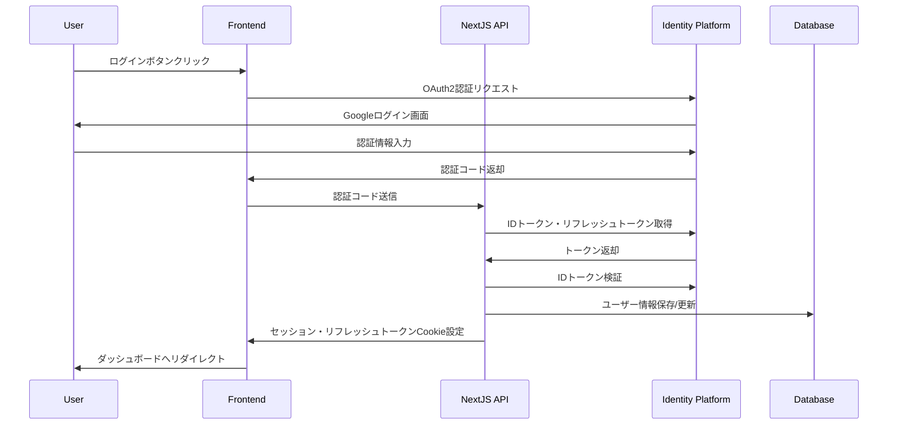

# Google Cloud Identity Platform 認証フロー

## 概要

このドキュメントでは、Google Cloud Identity Platform APIを直接使用した認証フローを説明します。Firebase Admin SDKは使用せず、Google Cloud APIを直接呼び出します。

## 認証フローの全体像



## トークンの種類と役割

### IDトークン
- **用途**: ユーザーの身元確認
- **有効期限**: 1時間
- **内容**: ユーザー情報（email、name、picture等）を含むJWT

### リフレッシュトークン
- **用途**: 新しいIDトークンの取得
- **有効期限**: 無期限（ただしユーザーが無効化可能）
- **保存場所**: httpOnlyのCookieで安全に保管

### セッショントークン（アプリ独自）
- **用途**: アプリ内でのセッション管理
- **有効期限**: 1時間（IDトークンと同期）
- **内容**: 最小限のユーザー情報を含むJWT

## クライアント側の実装

### Google Sign-In ボタン

```typescript
// features/auth/components/GoogleSignInButton.tsx
'use client'

import { useState } from 'react'
import { Button } from '@/shared/components/ui/button'
import { useRouter } from 'next/navigation'

export function GoogleSignInButton() {
  const [loading, setLoading] = useState(false)
  const router = useRouter()

  const handleSignIn = () => {
    setLoading(true)
    
    // Google OAuth2 URL構築
    const params = new URLSearchParams({
      client_id: process.env.NEXT_PUBLIC_GCP_CLIENT_ID!,
      redirect_uri: `${window.location.origin}/api/auth/callback/google`,
      response_type: 'code',
      scope: 'openid email profile',
      access_type: 'offline', // リフレッシュトークンを取得
      prompt: 'consent', // リフレッシュトークンを確実に取得
    })

    window.location.href = `https://accounts.google.com/o/oauth2/v2/auth?${params}`
  }

  return (
    <Button
      onClick={handleSignIn}
      disabled={loading}
      variant="outline"
      className="w-full"
    >
      {loading ? (
        'サインイン中...'
      ) : (
        <>
          <svg className="mr-2 h-4 w-4" viewBox="0 0 24 24">
            {/* Google Icon SVG */}
          </svg>
          Googleでサインイン
        </>
      )}
    </Button>
  )
}
```

## サーバー側の実装

External handler では Command/Query を分離し、Server-only 関数と Server Action を組み合わせて利用します。命名は [AIP-190](https://google.aip.dev/190) に準拠し、操作 + リソース（例: `createSessionServer`, `getSessionServer`, `deleteSessionServer`）とします。

### Command: セッション作成・削除

```typescript
// external/handler/auth/command.server.ts
export async function createSessionServer(data: CreateSessionInput) {
  const validated = createSessionSchema.parse(data)

  const authResult = await authService.signInWithEmailPassword(
    validated.email,
    validated.password
  )

  const user = await userManagementService.getOrCreateUser({
    email: authResult.userInfo.email,
    name: authResult.userInfo.name,
    externalId: authResult.userInfo.id,
  })

  await auditService.logUserLogin(user, SERVER_CONTEXT)

  const cookieStore = await cookies()
  cookieStore.set('auth-token', authResult.idToken, { httpOnly: true, path: '/' })
  cookieStore.set('user-id', user.getId().getValue(), { httpOnly: true, path: '/' })

  return {
    success: true,
    redirectUrl: validated.redirectUrl ?? '/dashboard',
  }
}

export async function deleteSessionServer(userId?: string) {
  const cookieStore = await cookies()
  const storedUserId = userId ?? cookieStore.get('user-id')?.value
  const token = cookieStore.get('auth-token')?.value

  if (!storedUserId || !token) {
    return { success: false, error: 'No active session' }
  }

  const user = await userManagementService.findUserById(storedUserId)
  if (user) {
    try {
      await authService.revokeAuthentication(token)
    } catch (error) {
      console.error('Failed to revoke token:', error)
    }

    await auditService.logUserLogout(user, SERVER_CONTEXT)
  }

  cookieStore.delete('auth-token')
  cookieStore.delete('user-id')

  return { success: true }
}

// external/handler/auth/command.action.ts
'use server'
export async function createSessionAction(data: CreateSessionInput) {
  return createSessionServer(data)
}

export async function deleteSessionAction(userId?: string) {
  return deleteSessionServer(userId)
}
```

### Query: セッション取得・権限確認

```typescript
// external/handler/auth/query.server.ts
export async function getSessionServer(data?: GetSessionInput) {
  const validated = getSessionSchema.parse(data ?? {})
  const cookieStore = await cookies()
  const token = cookieStore.get('auth-token')?.value
  const storedUserId = cookieStore.get('user-id')?.value

  if (!token || !storedUserId) {
    return { isAuthenticated: false }
  }

  const tokenInfo = await authService.verifyToken(token)
  if (!tokenInfo) {
    cookieStore.delete('auth-token')
    cookieStore.delete('user-id')
    return { isAuthenticated: false }
  }

  const user = await userManagementService.findUserById(storedUserId)
  if (!user || (validated.userId && validated.userId !== user.getId().getValue())) {
    return { isAuthenticated: false }
  }

  return {
    user: userManagementService.toUserProfile(user),
    isAuthenticated: true,
  }
}

export async function checkPermissionServer(permission: string) {
  const session = await getSessionServer()
  if (!session.isAuthenticated || !session.user) {
    return false
  }

  const user = await userManagementService.findUserById(session.user.id)
  if (!user) {
    return false
  }

  return userManagementService.hasPermission(user, permission)
}

// external/handler/auth/query.action.ts
'use server'
export async function getSessionAction(data?: GetSessionInput) {
  return getSessionServer(data)
}

export async function checkPermissionAction(permission: string) {
  return checkPermissionServer(permission)
}
```

### クライアント側の自動トークンリフレッシュ

```typescript
// shared/hooks/useAuth.tsx
'use client'

import { useEffect } from 'react'
import { useRouter } from 'next/navigation'

export function useAuth() {
  const router = useRouter()

  useEffect(() => {
    // 定期的にトークンをリフレッシュ
    const interval = setInterval(async () => {
      try {
        const response = await fetch('/api/auth/refresh', {
          method: 'POST',
        })
        
        if (!response.ok) {
          router.push('/login')
        }
      } catch (error) {
        console.error('Token refresh failed:', error)
      }
    }, 50 * 60 * 1000) // 50分ごと（IDトークンの有効期限1時間より前）

    return () => clearInterval(interval)
  }, [router])
}

// app/providers.tsx でグローバルに使用
export function AuthProvider({ children }: { children: React.ReactNode }) {
  useAuth()
  return <>{children}</>
}
```

## データベース連携

```typescript
// external/db/users.ts
import 'server-only'
import { db } from './client'
import { users } from './schema'
import { eq } from 'drizzle-orm'

export async function upsertUser(identityUser: IdentityPlatformUser) {
  const userData = {
    email: identityUser.email!,
    name: identityUser.name || identityUser.email!.split('@')[0],
    emailVerified: identityUser.emailVerified,
    picture: identityUser.picture,
    identityPlatformId: identityUser.uid,
    lastLoginAt: new Date(),
  }

  await db
    .insert(users)
    .values(userData)
    .onConflictDoUpdate({
      target: users.email,
      set: {
        ...userData,
        updatedAt: new Date(),
      },
    })
}
```

## セッション管理

### セッション検証ヘルパー

```typescript
// external/lib/auth/session.ts
import 'server-only'
import { cookies } from 'next/headers'
import jwt from 'jsonwebtoken'
import { sessionTokenSchema } from '@/external/types/identity-platform'

export async function getSession() {
  const sessionCookie = cookies().get('session')
  
  if (!sessionCookie) {
    return null
  }

  try {
    const decoded = jwt.verify(
      sessionCookie.value, 
      process.env.JWT_SECRET!
    )
    
    // Zodでバリデーション
    const session = sessionTokenSchema.parse(decoded)
    
    // 有効期限チェック
    if (session.exp < Math.floor(Date.now() / 1000)) {
      return null
    }
    
    return session
  } catch (error) {
    return null
  }
}

export async function requireAuth() {
  const session = await getSession()
  
  if (!session) {
    throw new Error('Unauthorized')
  }
  
  return session
}
```

### Server Componentでの使用

```typescript
// app/dashboard/page.tsx
import { requireAuth } from '@/external/lib/auth/session'
import { redirect } from 'next/navigation'

export default async function DashboardPage() {
  try {
    const session = await requireAuth()
    
    return (
      <div>
        <h1>Welcome, {session.name || session.email}</h1>
        {/* ダッシュボードコンテンツ */}
      </div>
    )
  } catch {
    redirect('/login')
  }
}
```

## サインアウト

```typescript
// app/api/auth/signout/route.ts
import { NextResponse } from 'next/server'
import { cookies } from 'next/headers'
import { getSession } from '@/external/lib/auth/session'
import { revokeRefreshTokens } from '@/external/lib/auth/identity-platform-api'

export async function POST() {
  try {
    // 現在のセッション取得
    const session = await getSession()
    
    if (session) {
      // Identity Platform側でリフレッシュトークンを無効化
      await revokeRefreshTokens(session.userId)
    }
  } catch (error) {
    console.error('Failed to revoke tokens:', error)
  }
  
  // Cookie削除
  cookies().delete('session')
  cookies().delete('refresh-token')
  
  return NextResponse.json({ success: true })
}
```

## セキュリティのベストプラクティス

1. **リフレッシュトークンの安全な保管**: httpOnly Cookieで保存し、JavaScriptからアクセス不可に
2. **短いIDトークン有効期限**: 1時間に設定し、定期的にリフレッシュ
3. **CSRF対策**: State パラメータを使用してOAuth2フローを保護
4. **PKCE**: 認証コード横取り攻撃を防ぐため、今後実装予定
5. **トークンローテーション**: リフレッシュ時に新しいリフレッシュトークンも発行
6. **適切なスコープ**: 必要最小限の権限のみを要求（openid email profile）