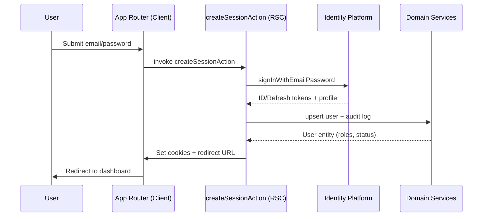

# Authentication Guide

This document describes how authentication works in the **Request & Approval System** sample application. The goal is to combine Next.js App Router ergonomics with secure, role-aware access control for the request lifecycle.

---

## Context

- **Identity Provider**: Google Cloud Identity Platform (email/password)
- **Session Layer**: NextAuth.js (Credentials provider)
- **Persistence**: Users stored via Drizzle ORM in PostgreSQL
- **Domain Roles**
  - `Requester` (creates and tracks own requests)
  - `Approver` (reviews and approves assigned requests)
  - `Admin` (global visibility + role management)

Roles are materialised in code through `UserRole` (`ADMIN`, `MEMBER`, `GUEST`). `MEMBER` maps to “Requester”, while `ADMIN` covers both “Approver” and administrative capabilities. The permission matrix in `UserManagementService#getPermissionsForRoles` is the single source of truth and should be extended as the approval workflow evolves.

---

## High-Level Architecture

```
Client (Next.js App Router)
        │
        │  (1) POST credentials via Server Action
        ▼
Server Action (createSessionAction)
        │
        │  (2) Delegate to AuthenticationService
        ▼
Google Identity Platform (REST)
        │
        │  (3) Return ID Token + Refresh Token + profile
        ▼
Domain Services (UserManagementService + AuditService)
        │
        │  (4) Persist / hydrate user + audit log
        ▼
Cookie Store + NextAuth Session
        │
        │  (5) Issue httpOnly cookies & update session
        ▼
Protected Routes / Feature Hooks
```

### Token & Cookie Strategy

| Item | Details | Storage |
|------|---------|---------|
| **ID Token** | 1-hour expiry JWT issued by Identity Platform | `auth-token` (httpOnly, SameSite=Lax, Secure in prod) |
| **User Id** | Internal UUID used by domain layer | `user-id` (httpOnly cookie) |
| **Refresh Token** | Returned by Identity Platform, used for silent renewals | Passed through server actions only (never exposed to client). Persistence & rotation TODO |

> **Note**: Refresh token persistence is intentionally deferred. The plan is to keep it server-only (encrypted DB or sealed cookies) once the request workload requires long-lived sessions.

---

## End-to-End Flow



Logout is the inverse flow: `deleteSessionAction` revokes the auth token (best-effort), clears cookies, and records an audit event.

---

## Implementation Details

### Server Actions (`src/external/handler/auth`)

| Action | Purpose |
|--------|---------|
| `createSessionAction` | Sign in, hydrate user, issue cookies |
| `createUserAction` | Sign up, hydrate user, issue cookies |
| `deleteSessionAction` | Revoke token + clear cookies |
| `getSessionServer` | Validate `auth-token`, return user profile |
| `checkPermissionServer` | Helper for RBAC checks |

These actions wrap the server-only counterparts in `command.server.ts` / `query.server.ts` so that client components can call them without leaking secrets.

### NextAuth Configuration (`features/auth/lib/option.ts`)

NextAuth is configured with a Credentials provider. The current stub simply echoes credentials; replace the `authorize` callback with a call to `createSessionServer` to align runtime behaviour with the domain layer:

```typescript
const credentialsProvider = CredentialsProvider({
  name: 'Email & Password',
  credentials: {
    email: { label: 'Email', type: 'text' },
    password: { label: 'Password', type: 'password' },
  },
  async authorize(credentials) {
    if (!credentials) return null
    const result = await createSessionServer({
      email: credentials.email,
      password: credentials.password,
    })
    return result.success
      ? { id: result.user.id, email: credentials.email }
      : null
  },
})
```

The exported `authOptions` are reused on the server (`getServerSession`) and client (`useSession`) to maintain a single source of truth.

### Server Utilities (`features/auth/servers`)

- `getSessionServer` (provided) wraps `getServerSession`.
- A `requireAuthServer` helper should be added to perform redirects on protected routes (see TODOs).
- RBAC helpers live in `UserManagementService` (`hasPermission`, `getUserPermissions`).

### Client Utilities (`features/auth/hooks`)

Currently implemented:

| Hook | Description |
|------|-------------|
| `useAuthSession` | Thin wrapper around `useSession` providing `isAuthenticated` / `isLoading` flags |

Planned hooks (see TODO):

- `useSignIn` / `useSignOut` built on top of the server actions
- `useHasPermission` to guard UI affordances (buttons, menu items)

### Example: Login Form (Client Component)

```tsx
'use client'

import { useTransition, useState } from 'react'
import { createSessionAction } from '@/external/handler/auth'
import { Button } from '@/shared/components/ui/button'
import { Input } from '@/shared/components/ui/input'
import { useRouter } from 'next/navigation'

export function LoginForm() {
  const router = useRouter()
  const [error, setError] = useState<string | null>(null)
  const [isPending, startTransition] = useTransition()

  const handleSubmit = (event: React.FormEvent<HTMLFormElement>) => {
    event.preventDefault()
    const formData = new FormData(event.currentTarget)

    startTransition(async () => {
      const result = await createSessionAction({
        email: formData.get('email') as string,
        password: formData.get('password') as string,
        redirectUrl: '/requests',
      })

      if (result.success && result.redirectUrl) {
        router.replace(result.redirectUrl)
      } else {
        setError(result.error ?? 'Authentication failed')
      }
    })
  }

  return (
    <form onSubmit={handleSubmit} className="space-y-4">
      <Input name="email" type="email" placeholder="you@example.com" required />
      <Input name="password" type="password" placeholder="••••••••" required />
      {error && <p className="text-sm text-destructive">{error}</p>}
      <Button type="submit" disabled={isPending} className="w-full">
        {isPending ? 'Signing in…' : 'Sign in'}
      </Button>
    </form>
  )
}
```

### Example: Server-Side Route Guard

```tsx
// app/(authenticated)/requests/page.tsx
import { redirect } from 'next/navigation'
import { getSessionServer } from '@/features/auth/servers/session.server'

export default async function RequestsPage() {
  const session = await getSessionServer()
  if (!session) redirect('/login')

  return <RequestsPageTemplate userId={session.user.id} />
}
```

Once `requireAuthServer` is implemented, prefer that helper to keep guards consistent.

---

## RBAC Integration

`UserManagementService#getPermissionsForRoles` exposes a permission array per role. Suggested mapping for the request workflow:

| Permission | Used By | Purpose |
|------------|---------|---------|
| `request.create` | Requester | Create new requests |
| `request.view` | All | View accessible requests |
| `request.view.own` | Requester | Limit list/detail to own records |
| `request.update.own` | Requester | Edit drafts before submission |
| `request.approve` | Approver/Admin | Approve or reject requests |
| `request.audit.read` | Admin | View audit trail |
| `user.manage` | Admin | Manage roles and statuses |

Update `permissionMap` accordingly when introducing the dedicated Approver role.

On the client, use permission checks to toggle actions:

```tsx
const canApprove = permissions.includes('request.approve')
return canApprove ? <ApproveButton /> : null
```

---

## Security Checklist

- `auth-token` and `user-id` cookies are `httpOnly`, `SameSite=Lax`, and `Secure` outside development.
- All server-only logic is wrapped with `import 'server-only'`.
- Identity Platform credentials come from environment variables (`GCP_IDENTITY_PLATFORM_API_KEY`, `GCP_PROJECT_ID`).
- Never expose refresh tokens to the browser. Until persistence is implemented, require reauthentication when the ID token expires.
- Audit every sign-in and sign-out (`AuditService`) to maintain the compliance trail.

---

## Roadmap / TODO

- [ ] Persist refresh tokens securely (encrypted column or sealed cookie) and expose `refreshSessionAction`.
- [ ] Implement `requireAuthServer` and `redirectIfAuthenticatedServer` helpers in `features/auth/servers`.
- [ ] Replace the mock `authorize` callback in `authOptions` with the real session creation logic.
- [ ] Introduce `useSignIn`, `useSignOut`, and `useHasPermission` hooks to standardise client usage.
- [ ] Expand `UserRole` enum to include explicit `APPROVER` and update `permissionMap`.
- [ ] Add middleware-based short-circuit for `/requests` and other protected routes.
- [ ] Re-enable the layout guard in `AuthenticatedLayoutWrapper` once implemented.
