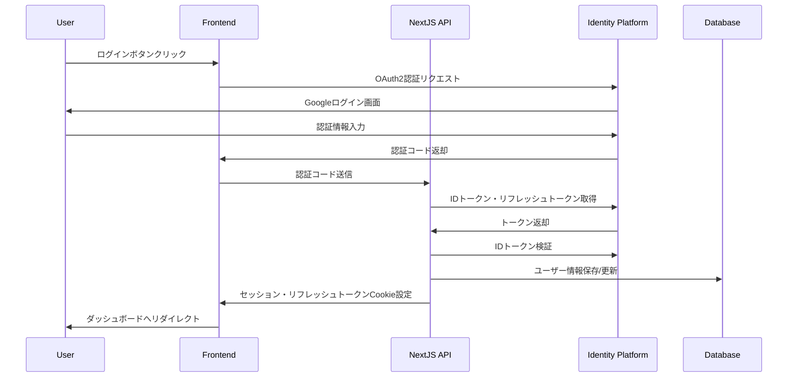

# Google Cloud Identity Platform 認証フロー

## 概要

このドキュメントでは、Google Cloud Identity Platform APIを直接使用した認証フローを説明します。Firebase Admin SDKは使用せず、Google Cloud APIを直接呼び出します。

## 認証フローの全体像



## トークンの種類と役割

### IDトークン
- **用途**: ユーザーの身元確認
- **有効期限**: 1時間
- **内容**: ユーザー情報（email、name、picture等）を含むJWT

### リフレッシュトークン
- **用途**: 新しいIDトークンの取得
- **有効期限**: 無期限（ただしユーザーが無効化可能）
- **保存場所**: httpOnlyのCookieで安全に保管

### セッショントークン（アプリ独自）
- **用途**: アプリ内でのセッション管理
- **有効期限**: 1時間（IDトークンと同期）
- **内容**: 最小限のユーザー情報を含むJWT

## クライアント側の実装

### Google Sign-In ボタン

```typescript
// features/auth/components/GoogleSignInButton.tsx
'use client'

import { useState } from 'react'
import { Button } from '@/shared/components/ui/button'
import { useRouter } from 'next/navigation'

export function GoogleSignInButton() {
  const [loading, setLoading] = useState(false)
  const router = useRouter()

  const handleSignIn = () => {
    setLoading(true)
    
    // Google OAuth2 URL構築
    const params = new URLSearchParams({
      client_id: process.env.NEXT_PUBLIC_GCP_CLIENT_ID!,
      redirect_uri: `${window.location.origin}/api/auth/callback/google`,
      response_type: 'code',
      scope: 'openid email profile',
      access_type: 'offline', // リフレッシュトークンを取得
      prompt: 'consent', // リフレッシュトークンを確実に取得
    })

    window.location.href = `https://accounts.google.com/o/oauth2/v2/auth?${params}`
  }

  return (
    <Button
      onClick={handleSignIn}
      disabled={loading}
      variant="outline"
      className="w-full"
    >
      {loading ? (
        'サインイン中...'
      ) : (
        <>
          <svg className="mr-2 h-4 w-4" viewBox="0 0 24 24">
            {/* Google Icon SVG */}
          </svg>
          Googleでサインイン
        </>
      )}
    </Button>
  )
}
```

## サーバー側の実装

### OAuth2 コールバックハンドラー

```typescript
// app/api/auth/callback/google/route.ts
import { NextRequest, NextResponse } from 'next/server'
import { createSession, verifyIdToken } from '@/external/lib/auth/identity-platform'
import { upsertUser } from '@/external/db/users'

export async function GET(request: NextRequest) {
  const searchParams = request.nextUrl.searchParams
  const code = searchParams.get('code')

  if (!code) {
    return NextResponse.redirect(new URL('/login?error=no_code', request.url))
  }

  try {
    // 認証コードをIDトークンに交換（Google OAuth2 Token Endpoint）
    const tokenResponse = await fetch('https://oauth2.googleapis.com/token', {
      method: 'POST',
      headers: { 'Content-Type': 'application/x-www-form-urlencoded' },
      body: new URLSearchParams({
        code,
        client_id: process.env.GCP_CLIENT_ID!,
        client_secret: process.env.GCP_CLIENT_SECRET!,
        redirect_uri: `${process.env.NEXT_PUBLIC_APP_URL}/api/auth/callback/google`,
        grant_type: 'authorization_code',
      }),
    })

    if (!tokenResponse.ok) {
      throw new Error('Token exchange failed')
    }

    const tokens = await tokenResponse.json()
    
    if (!tokens.id_token) {
      throw new Error('No ID token received')
    }

    // Identity Platform APIでユーザー情報取得・検証
    const userInfo = await verifyIdToken(tokens.id_token)
    
    if (!userInfo) {
      throw new Error('Token verification failed')
    }
    
    // データベースにユーザー情報を保存/更新
    await upsertUser(userInfo)
    
    // セッション作成（リフレッシュトークンも保存）
    const session = await createSession(tokens.id_token, tokens.refresh_token)
    
    if (!session.success) {
      throw new Error('Session creation failed')
    }

    // ダッシュボードへリダイレクト
    return NextResponse.redirect(new URL('/dashboard', request.url))
  } catch (error) {
    console.error('Authentication error:', error)
    return NextResponse.redirect(
      new URL('/login?error=authentication_failed', request.url)
    )
  }
}
```

### トークンリフレッシュエンドポイント

```typescript
// app/api/auth/refresh/route.ts
import { NextRequest, NextResponse } from 'next/server'
import { refreshTokens } from '@/external/lib/auth/identity-platform'

export async function GET(request: NextRequest) {
  const redirect = request.nextUrl.searchParams.get('redirect') || '/dashboard'
  
  const result = await refreshTokens()
  
  if (!result.success) {
    return NextResponse.redirect(new URL('/login', request.url))
  }
  
  // 元のページへリダイレクト
  return NextResponse.redirect(new URL(redirect, request.url))
}

// クライアントからのAJAXリクエスト用
export async function POST() {
  const result = await refreshTokens()
  
  if (!result.success) {
    return NextResponse.json(
      { error: 'Token refresh failed' },
      { status: 401 }
    )
  }
  
  return NextResponse.json({ success: true })
}
```

### Identity Platform API呼び出し

```typescript
// external/lib/auth/identity-platform-api.ts
import 'server-only'

const IDENTITY_PLATFORM_BASE_URL = 'https://identitytoolkit.googleapis.com/v1'
const API_KEY = process.env.GCP_IDENTITY_PLATFORM_API_KEY

// ユーザー情報取得
export async function getUserInfo(idToken: string) {
  const response = await fetch(
    `${IDENTITY_PLATFORM_BASE_URL}/accounts:lookup?key=${API_KEY}`,
    {
      method: 'POST',
      headers: { 'Content-Type': 'application/json' },
      body: JSON.stringify({ idToken }),
    }
  )

  if (!response.ok) {
    throw new Error('Failed to get user info')
  }

  const data = await response.json()
  return data.users?.[0]
}

// メールでユーザー検索
export async function getUserByEmail(email: string) {
  const response = await fetch(
    `${IDENTITY_PLATFORM_BASE_URL}/accounts:lookup?key=${API_KEY}`,
    {
      method: 'POST',
      headers: { 'Content-Type': 'application/json' },
      body: JSON.stringify({ 
        email: [email],
        returnSecureToken: false,
      }),
    }
  )

  if (!response.ok) {
    return null
  }

  const data = await response.json()
  return data.users?.[0]
}

// リフレッシュトークンの無効化
export async function revokeRefreshTokens(uid: string) {
  const response = await fetch(
    `${IDENTITY_PLATFORM_BASE_URL}/accounts:update?key=${API_KEY}`,
    {
      method: 'POST',
      headers: { 'Content-Type': 'application/json' },
      body: JSON.stringify({
        localId: uid,
        validSince: Math.floor(Date.now() / 1000),
      }),
    }
  )

  if (!response.ok) {
    throw new Error('Failed to revoke tokens')
  }
}
```

### クライアント側の自動トークンリフレッシュ

```typescript
// shared/hooks/useAuth.tsx
'use client'

import { useEffect } from 'react'
import { useRouter } from 'next/navigation'

export function useAuth() {
  const router = useRouter()

  useEffect(() => {
    // 定期的にトークンをリフレッシュ
    const interval = setInterval(async () => {
      try {
        const response = await fetch('/api/auth/refresh', {
          method: 'POST',
        })
        
        if (!response.ok) {
          router.push('/login')
        }
      } catch (error) {
        console.error('Token refresh failed:', error)
      }
    }, 50 * 60 * 1000) // 50分ごと（IDトークンの有効期限1時間より前）

    return () => clearInterval(interval)
  }, [router])
}

// app/providers.tsx でグローバルに使用
export function AuthProvider({ children }: { children: React.ReactNode }) {
  useAuth()
  return <>{children}</>
}
```

## データベース連携

```typescript
// external/db/users.ts
import 'server-only'
import { db } from './client'
import { users } from './schema'
import { eq } from 'drizzle-orm'

export async function upsertUser(identityUser: IdentityPlatformUser) {
  const userData = {
    email: identityUser.email!,
    name: identityUser.name || identityUser.email!.split('@')[0],
    emailVerified: identityUser.emailVerified,
    picture: identityUser.picture,
    identityPlatformId: identityUser.uid,
    lastLoginAt: new Date(),
  }

  await db
    .insert(users)
    .values(userData)
    .onConflictDoUpdate({
      target: users.email,
      set: {
        ...userData,
        updatedAt: new Date(),
      },
    })
}
```

## セッション管理

### セッション検証ヘルパー

```typescript
// external/lib/auth/session.ts
import 'server-only'
import { cookies } from 'next/headers'
import jwt from 'jsonwebtoken'
import { sessionTokenSchema } from '@/external/types/identity-platform'

export async function getSession() {
  const sessionCookie = cookies().get('session')
  
  if (!sessionCookie) {
    return null
  }

  try {
    const decoded = jwt.verify(
      sessionCookie.value, 
      process.env.JWT_SECRET!
    )
    
    // Zodでバリデーション
    const session = sessionTokenSchema.parse(decoded)
    
    // 有効期限チェック
    if (session.exp < Math.floor(Date.now() / 1000)) {
      return null
    }
    
    return session
  } catch (error) {
    return null
  }
}

export async function requireAuth() {
  const session = await getSession()
  
  if (!session) {
    throw new Error('Unauthorized')
  }
  
  return session
}
```

### Server Componentでの使用

```typescript
// app/dashboard/page.tsx
import { requireAuth } from '@/external/lib/auth/session'
import { redirect } from 'next/navigation'

export default async function DashboardPage() {
  try {
    const session = await requireAuth()
    
    return (
      <div>
        <h1>Welcome, {session.name || session.email}</h1>
        {/* ダッシュボードコンテンツ */}
      </div>
    )
  } catch {
    redirect('/login')
  }
}
```

## サインアウト

```typescript
// app/api/auth/signout/route.ts
import { NextResponse } from 'next/server'
import { cookies } from 'next/headers'
import { getSession } from '@/external/lib/auth/session'
import { revokeRefreshTokens } from '@/external/lib/auth/identity-platform-api'

export async function POST() {
  try {
    // 現在のセッション取得
    const session = await getSession()
    
    if (session) {
      // Identity Platform側でリフレッシュトークンを無効化
      await revokeRefreshTokens(session.userId)
    }
  } catch (error) {
    console.error('Failed to revoke tokens:', error)
  }
  
  // Cookie削除
  cookies().delete('session')
  cookies().delete('refresh-token')
  
  return NextResponse.json({ success: true })
}
```

## セキュリティのベストプラクティス

1. **リフレッシュトークンの安全な保管**: httpOnly Cookieで保存し、JavaScriptからアクセス不可に
2. **短いIDトークン有効期限**: 1時間に設定し、定期的にリフレッシュ
3. **CSRF対策**: State パラメータを使用してOAuth2フローを保護
4. **PKCE**: 認証コード横取り攻撃を防ぐため、今後実装予定
5. **トークンローテーション**: リフレッシュ時に新しいリフレッシュトークンも発行
6. **適切なスコープ**: 必要最小限の権限のみを要求（openid email profile）